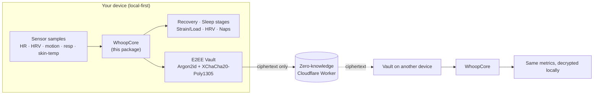

# WhoopCore

**A pure, deterministic health-analytics engine — recovery, sleep staging, HRV, strain/load, nap detection, and an end-to-end-encrypted sync vault — in one dependency-light Swift package, validated against golden vectors.**

[](https://github.com/satayutata/geniemax-core/actions/workflows/ci.yml)
[](LICENSE)
[](https://swift.org)

> **Independent project — not affiliated with, endorsed by, or connected to WHOOP.** "WHOOP" is a trademark of
> its respective owner. This library reads and analyses biometric data from devices **you own**, on the principle
> that your health data should stay on your device. It contains no firmware and no device credentials.

## Why

Most wearable platforms keep your raw data behind a subscription and a cloud you don't control. WhoopCore is the
opposite: a **local-first** analytics core you can read, audit, and run yourself. It takes per-minute sensor samples
(heart rate, HRV, motion, respiratory rate, skin temperature) and turns them into the metrics a recovery/sleep app
needs — with every number covered by tests, so you can trust the math.

## Showcase — *GenieMax*, the app this engine powers

> The screens below are from **GenieMax**, an iOS companion app built on top of WhoopCore. **This repository is the
> analytics engine, not the app** — the app is a separate project. Screenshots use synthetic demo data.

<table>
  <tr>
    <td align="center"><br><sub><b>Today</b> — recovery, strain & readiness</sub></td>
    <td align="center"><br><sub><b>Sleep</b> — stages, SRI, sleep debt</sub></td>
    <td align="center"><br><sub><b>Vitals</b> — full biometrics panel</sub></td>
    <td align="center"><br><sub><b>HRV</b> — baselines + night-to-night</sub></td>
  </tr>
  <tr>
    <td align="center"><br><sub><b>Workout</b> — live timer & strain</sub></td>
    <td align="center"><br><sub><b>Device & calibration</b></sub></td>
    <td align="center"><br><sub><b>AI coach</b> — grounded in your data</sub></td>
    <td align="center"><sub>…and more</sub></td>
  </tr>
</table>

**What the engine enables in the app:**
- 🟢 **Recovery, strain & readiness** rings computed from HRV, RHR and sleep.
- 😴 **Sleep staging + hypnogram** — deep/REM/light/wake, efficiency, sleep-regularity index (SRI), sleep debt.
- ❤️ **Full biometrics** — HR, resting HR, HRV (RMSSD **and** SDNN), respiratory rate, skin temperature, stress.
- 🫀 **Cardio age / VO₂max** estimated from your own heart-rate response.
- 📈 **Per-metric deep-dives** — personal fast/slow baselines, alarms, and night-to-night trends.
- ⏱️ **Workout & interval timers** — round-based, with haptics.
- 📲 **Lock-screen Live Activity & Dynamic Island** — glance at live workout metrics with the phone locked.
- ⚖️ **Biometric import & calibration** — HRmax, weight, and body-composition entry.
- 💬 **AI coach chat** — explanations grounded in *your* numbers.
- 🔒 **End-to-end-encrypted sync** across devices — the server only ever sees ciphertext.

## Architecture



## What's inside

| Area | Modules |
|------|---------|
| **Sleep** | `SleepStaging`, `SleepWindow`, `SleepArchitecture`, `NapDetector`, `SleepNarrative` |
| **Recovery & load** | `RecoveryEngine`, `Baseline`, `Scores`, `DailyMetrics` (CTL/ATL/TSB, ACWR), `Physiology` |
| **Cardio** | `HRV` (RMSSD/SDNN), `PPGHRV`, `RhythmCheck` / `RhythmFeatures` (non-diagnostic rhythm screening) |
| **Energy & activity** | calories, `StepCounter`, `Workout` |
| **Privacy / sync** | `E2EEVault` (Argon2id + XChaCha20-Poly1305), `HLC`, `SyncEngine`, `SectionSplitter` |
| **Device frames** | `WhoopFrame` / `WhoopDecode` — interoperability parsing of data frames from a device you own |

Companion: [`backend/`](backend/) — a zero-knowledge **Cloudflare Worker** that stores only end-to-end-encrypted
blobs (the server never sees plaintext). Deploy your own; see [`backend/README.md`](backend/README.md).

## Quick start

```swift
// Package.swift
.package(url: "https://github.com/satayutata/geniemax-core", from: "1.0.0")
// target deps: .product(name: "WhoopCore", package: "geniemax-core")
```

```bash
git clone https://github.com/satayutata/geniemax-core && cd geniemax-core
swift test          # runs the full golden-vector suite
```

```swift
import WhoopCore

let samples: [SleepSample] = …            // per-minute (ts, hr, hrv, motion, respiratory, skinTemp)
let sleep = SleepStaging.stage(samples)   // stages, TST, efficiency, hypnogram
print(sleep.tst, sleep.deep, sleep.rem, sleep.light)
```

## Tested

The engine is validated by **golden-vector tests** — recorded input → expected output — so a refactor that changes
a number fails CI. Run `swift test`. The fixtures under `Tests/WhoopCoreTests/Fixtures` use time-shifted,
de-identified sample data (no real dates, no personal identifiers).

## Scope & safety

- **No BLE transport / connection code** is included — this package only *interprets* data you already have.
- **No secrets, no personal data**: there are no API keys, tokens, accounts, or real health records in this repo.
- Rhythm screening is **wellness/experimental and non-diagnostic** — not a medical device.

## Acknowledgements

This project stands on prior open work:
- **Goose — "Local Companion for WHOOP 5.0"** — the local-first companion project whose approach and public
  reverse-engineering this work studied and built on. *(add the canonical Goose repo link here before publishing)*
- **[Bevel](https://www.bevel.health/)** — a major *visual/UX design* reference for health-metric surfaces (Goose credits it too). Not affiliated.
- **[swift-sodium](https://github.com/jedisct1/swift-sodium)** / libsodium — the cryptographic primitives behind the E2EE vault.
- **BIP-39** — the standard English word list used for recovery phrases.
- Public wearable / HRV / sleep research, incl. heart-rate-volatility work separating true sleep from quiet wake.

See [THIRD-PARTY-NOTICES.md](THIRD-PARTY-NOTICES.md) for bundled-dependency licenses.

## Contributing

Issues and PRs welcome — see [CONTRIBUTING.md](CONTRIBUTING.md). Parity with the golden vectors is the bar: keep
`swift test` green. Security reports: [SECURITY.md](SECURITY.md).

## License

[MIT](LICENSE) © 2026 GenieMax Contributors. Third-party components keep their own licenses.
