<p align="center">
  
</p>

<h1 align="center">GenieMax</h1>

<p align="center">
  <b>Free, open health-analytics engine</b> — recovery, sleep staging, HRV, strain/load, nap detection,<br>
  calorie tracking, and an end-to-end-encrypted sync vault. Built for the community and for learning,<br>
  so the science of recovery and sleep isn't locked behind a $200+ device and a forever-subscription.
</p>

<p align="center">
  <a href="https://github.com/satayutata/geniemax-core/actions/workflows/ci.yml"></a>
  <a href="LICENSE"></a>
  
  <a href="https://testflight.apple.com/join/XNHDWMgh"></a>
</p>

<p align="center">
  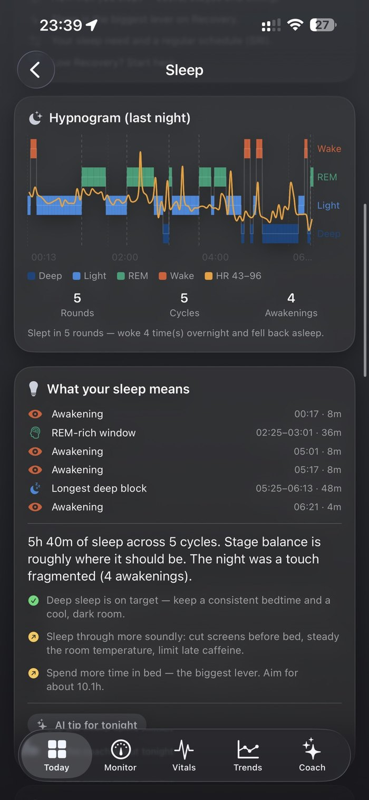
  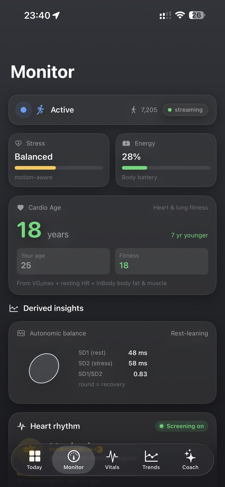
  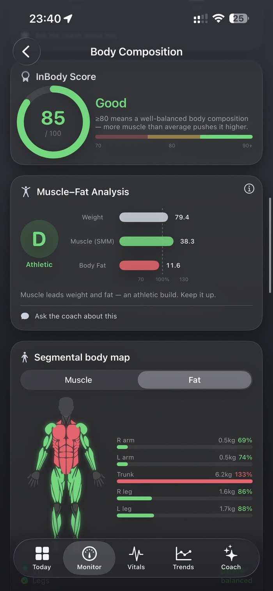
</p>

## Why this exists

Recovery, sleep, and HRV insights are some of the most useful things a wearable can give you — and they're almost
always trapped behind **expensive hardware plus a monthly subscription**, in a cloud you don't control. The math
behind those numbers is well-published science. So why should seeing *your own* data cost you forever?

GenieMax is that math, **free and open**, built to **give away** — for anyone who wants to learn how recovery/sleep
analytics actually work, run them on their own data, and own the result. No subscription, no lock-in, your data stays
on your device.

## 📲 Try the app

A companion iOS app (the screens below) is in public beta on **TestFlight**:
**[→ Join the beta on TestFlight](https://testflight.apple.com/join/XNHDWMgh)**

## Compatibility

| | Supported now | Not yet |
|---|---|---|
| **Sensor hardware** | **WHOOP 5.0** · **WHOOP MG** | other wristbands / wearables |
| **Platform** | **iOS** (TestFlight) | **Android** |

The frame decoding currently targets the WHOOP 5.0 / WHOOP MG data format only — other devices, and an Android
client, are on the roadmap.

## The story

It started as a simple frustration: a perfectly good fitness band on my wrist, streaming rich biometric data every
second — and I couldn't *see* my own numbers without paying every month, forever. The data was mine. The science was
public. Only the software stood in the way.

So I set out to close that gap, and it turned out to be a genuinely hard, fun problem:

1. **Reverse-engineering the data.** The band streams its sensor data in an **undocumented binary format** over
   Bluetooth. There's no spec — just bytes. Figuring out which bytes meant what took capturing real streams,
   diffing frames, and a lot of patient guess-and-check to line decoded numbers up against ground truth.
2. **Binding raw bytes to real signals.** Once the frames were cracked, each field had to be mapped to a meaningful
   biometric — and the scaling/units verified against the official app's values until they matched.
3. **Turning signals into insight.** Raw HR and motion aren't "recovery" or "a sleep score". That's a second layer:
   the published sports-science models, implemented and **pinned with golden-vector tests** so the numbers are
   trustworthy and reproducible.

### What got decoded and bound

| Raw data frame | Decoded fields | Bound to |
|---|---|---|
| Realtime cardiac frame | beats-per-minute | Heart rate, recovery, strain |
| Beat-to-beat (RR) intervals | inter-beat timing | **HRV** (RMSSD & SDNN) |
| Multi-sensor frame | respiratory rate, skin temperature, sub-second HR | Respiration, temp trend, stress |
| IMU frame | 3-axis accelerometer + gyroscope | Motion, **steps**, sleep actigraphy |
| Optical frame | PPG / perfusion | SpO₂, perfusion, PPG-derived HRV |

## The math, in the open

Nothing here is a black box — a few examples (the **[full set of formulas is here →](docs/HOW-IT-WORKS.md)**):

$$\mathrm{RMSSD}=\sqrt{\frac{1}{N-1}\sum_{i=1}^{N-1}\bigl(RR_{i+1}-RR_i\bigr)^2}$$

$$\textbf{Day strain}=21\left(1-e^{-\mathrm{TRIMP}/\tau}\right)\qquad \textbf{Recovery}=100\,\Phi\!\left(0.55\,z_{HRV}-0.20\,z_{RHR}-0.10\,z_{RR}+0.15\,z_{Sleep}\right)$$

Every formula — HRV, zones, strain, training load (CTL/ATL/TSB), recovery, sleep, calories, fitness age — is written
out and matched by a unit test. **[See the full breakdown → docs/HOW-IT-WORKS.md](docs/HOW-IT-WORKS.md)**

## Showcase

> Real screens from the **GenieMax** iOS app (personal identifiers removed). **This repository is the analytics engine behind them.**

<table>
  <tr>
    <td align="center">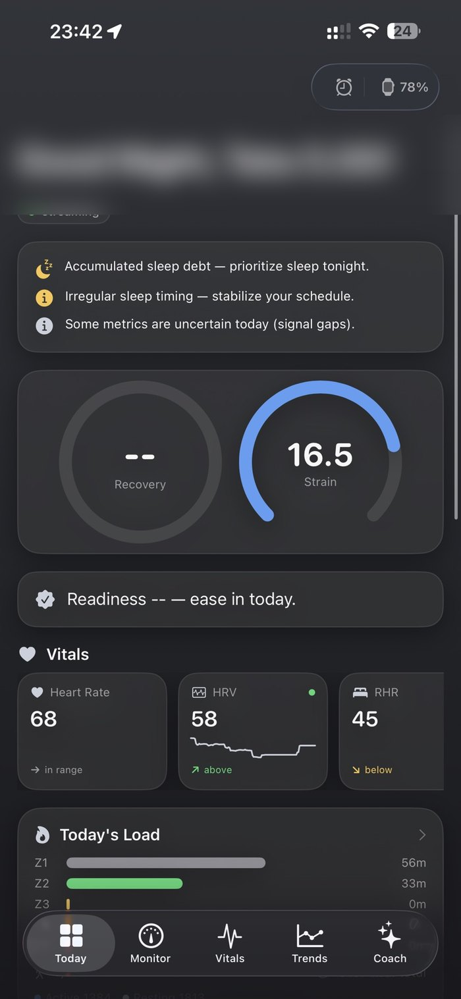<br><sub><b>Today</b> — recovery, strain & vitals</sub></td>
    <td align="center">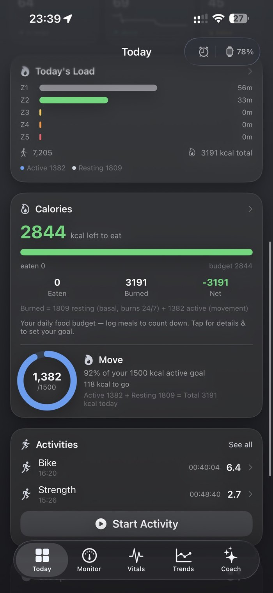<br><sub><b>Calories</b> — burn, Move & zones</sub></td>
    <td align="center">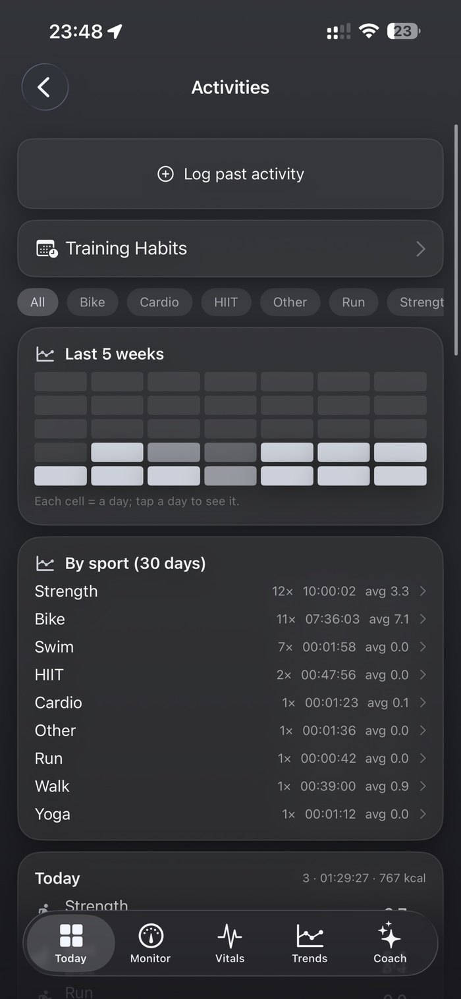<br><sub><b>Activities</b> — training log</sub></td>
    <td align="center">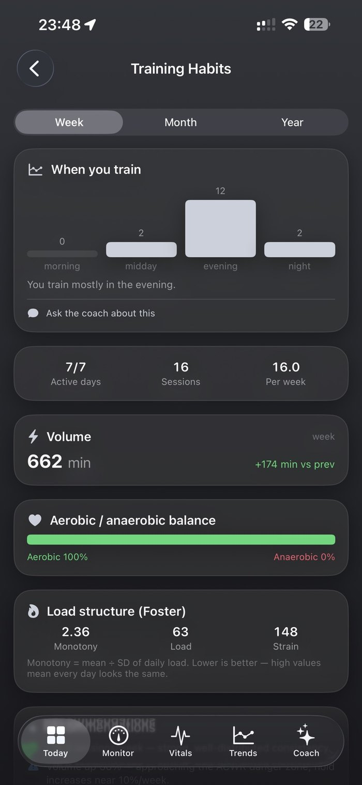<br><sub><b>Training habits</b></sub></td>
  </tr>
  <tr>
    <td align="center">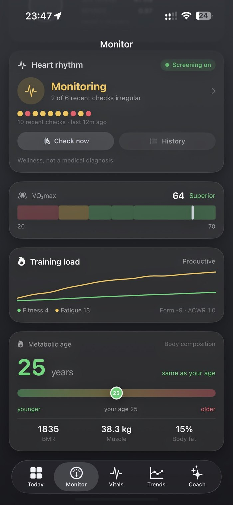<br><sub><b>Fitness</b> — VO₂max, rhythm, load</sub></td>
    <td align="center">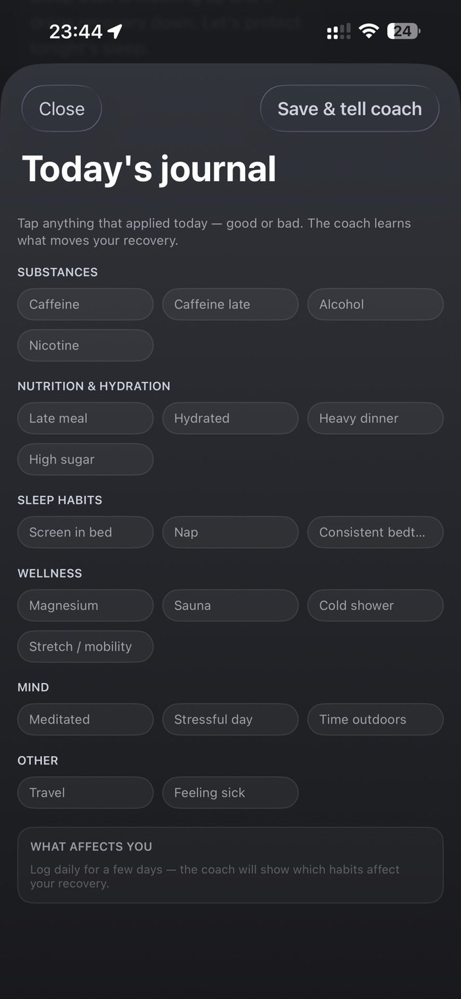<br><sub><b>Journal</b> — the coach learns</sub></td>
    <td align="center">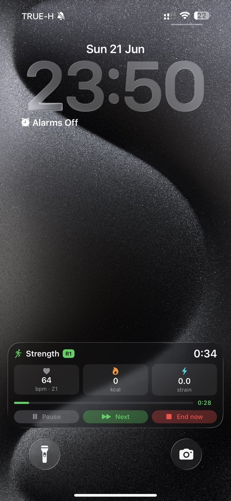<br><sub><b>Lock-screen Live Activity</b></sub></td>
    <td align="center"><sub>…and more</sub></td>
  </tr>
</table>

**What the engine enables:**
🟢 Recovery, strain & readiness · 😴 Sleep staging + hypnogram, SRI, sleep debt · ❤️ Full biometrics (HR, RHR, HRV
RMSSD & SDNN, respiratory, skin temp, stress) · 🫀 Cardio age / VO₂max · 🔥 Automatic calorie burn · 📸 Snap a meal
photo → AI logs calories & macros · ⏱️ Workout & interval timers · 📲 Lock-screen Live Activity & Dynamic Island ·
💬 AI coach grounded in your data · 🔒 End-to-end-encrypted sync.

## Architecture

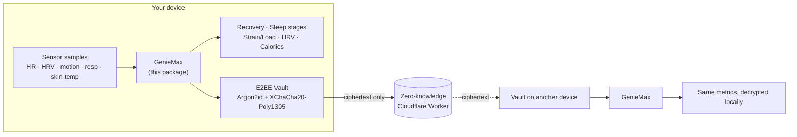

## What's inside

| Area | Modules |
|------|---------|
| **Sleep** | `SleepStaging`, `SleepWindow`, `SleepArchitecture`, `NapDetector`, `SleepNarrative` |
| **Recovery & load** | `RecoveryEngine`, `Baseline`, `Scores`, `DailyMetrics` (CTL/ATL/TSB, ACWR), `Physiology` |
| **Cardio** | `HRV` (RMSSD/SDNN), `PPGHRV`, `RhythmCheck` / `RhythmFeatures` (non-diagnostic rhythm screening) |
| **Energy & activity** | calories, `StepCounter`, `Workout` |
| **Privacy / sync** | `E2EEVault` (Argon2id + XChaCha20-Poly1305), `HLC`, `SyncEngine`, `SectionSplitter` |
| **Device frames** | frame parsing for interoperability with a device you own |

Companion: [`backend/`](backend/) — a zero-knowledge **Cloudflare Worker** that stores only end-to-end-encrypted
blobs (the server never sees plaintext). Deploy your own; see [`backend/README.md`](backend/README.md).

## Quick start

```swift
// Package.swift
.package(url: "https://github.com/satayutata/geniemax-core", from: "1.0.0")
// target deps: .product(name: "GenieMax", package: "geniemax-core")
```

```bash
git clone https://github.com/satayutata/geniemax-core && cd geniemax-core
swift test          # runs the full golden-vector suite
```

```swift
import GenieMax

let samples: [SleepSample] = …            // per-minute (ts, hr, hrv, motion, respiratory, skinTemp)
let sleep = SleepStaging.stage(samples)   // stages, TST, efficiency, hypnogram
print(sleep.tst, sleep.deep, sleep.rem, sleep.light)
```

## Tested

Validated by **golden-vector tests** — recorded input → expected output — so a refactor that changes a number fails
CI. Run `swift test`. Fixtures use time-shifted, de-identified sample data (no real dates, no personal identifiers).

## Scope & safety

- **No connection/transport code** is included — this package only *interprets* data you already have.
- **No secrets, no personal data**: no API keys, tokens, accounts, or real health records in this repo.
- Rhythm screening is **wellness/experimental and non-diagnostic** — not a medical device.
- Independent project — **not affiliated with, endorsed by, or connected to WHOOP** (a trademark of its owner).

## Acknowledgements

- **Goose** — the open-source companion project (for the same wearable) whose approach and public reverse-engineering
  this work studied and built on. *(add the canonical Goose repo link here before publishing)*
- Visual/UX design inspired by modern health-dashboard styles — no brand affiliation.
- **[swift-sodium](https://github.com/jedisct1/swift-sodium)** / libsodium — the crypto behind the vault.
- **BIP-39** — the standard English word list used for recovery phrases.
- Public HRV / sleep research, incl. heart-rate-volatility work separating true sleep from quiet wake.

See [THIRD-PARTY-NOTICES.md](THIRD-PARTY-NOTICES.md) for bundled-dependency licenses.

## Contributing

Issues and PRs welcome — see [CONTRIBUTING.md](CONTRIBUTING.md). Parity with the golden vectors is the bar: keep
`swift test` green. Security reports: [SECURITY.md](SECURITY.md).

## License

[MIT](LICENSE) © 2026 GenieMax Contributors — free to use, learn from, and share. Third-party components keep their own licenses.
