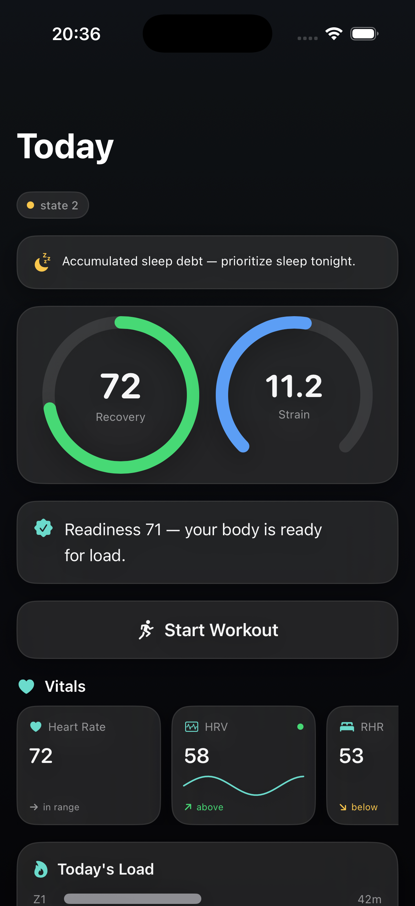
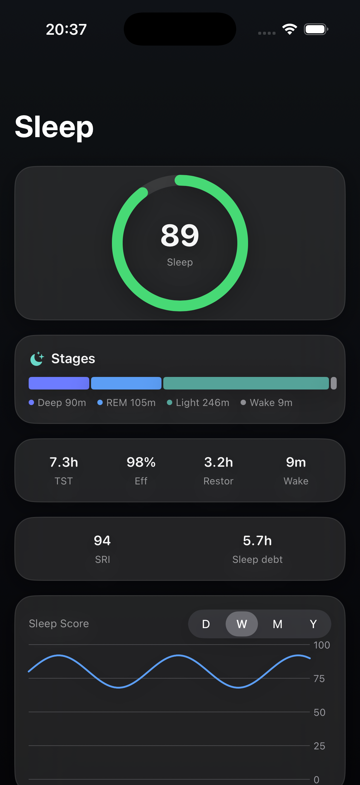
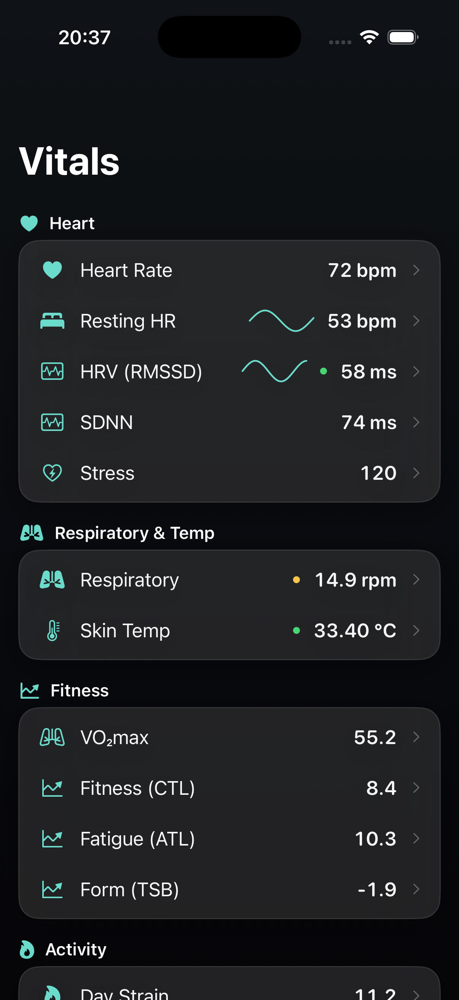
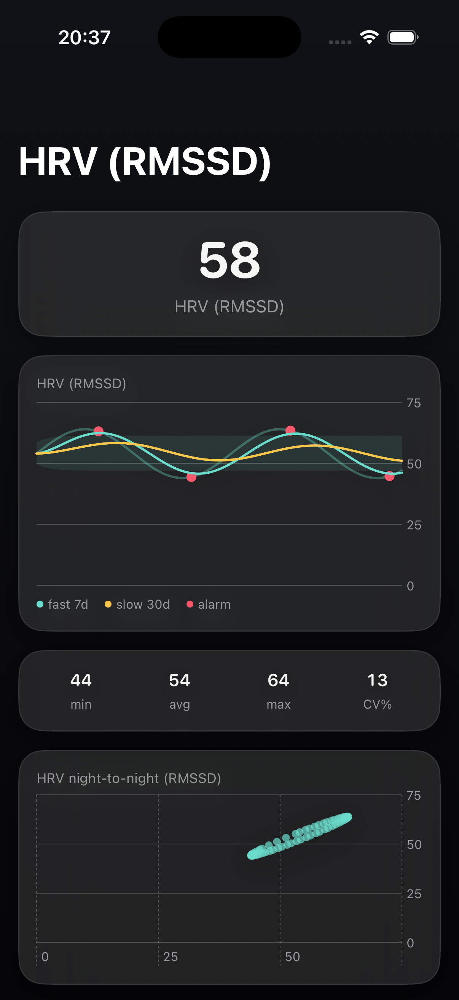
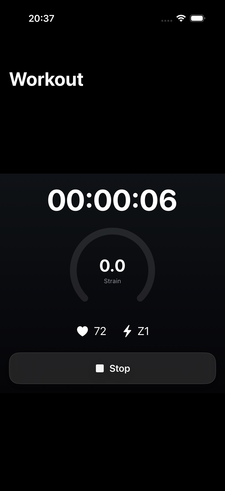
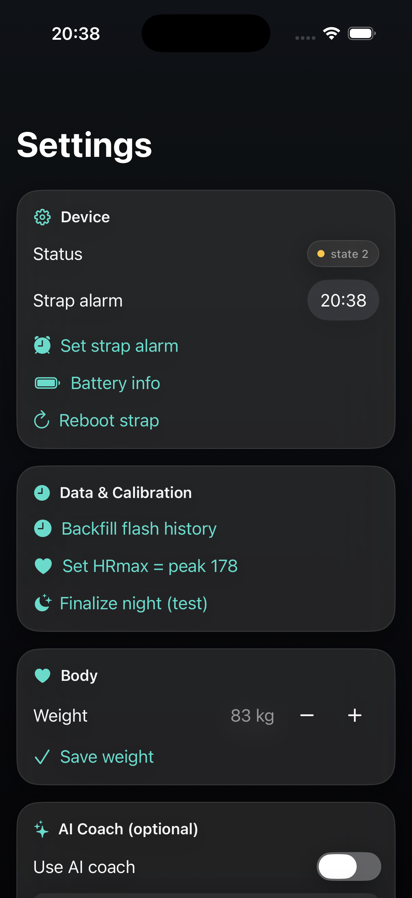
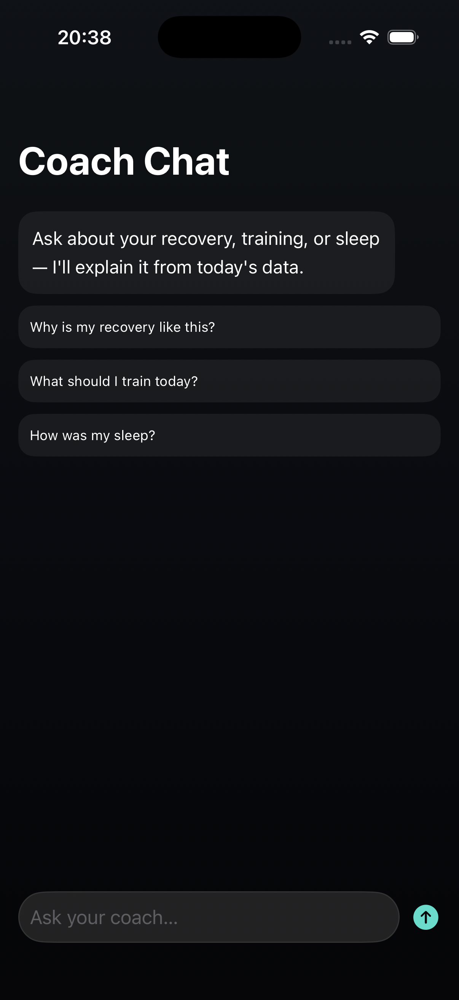

# WhoopCore

**Free, open, MIT health-analytics engine — recovery, sleep staging, HRV, strain/load, nap detection, calorie tracking, and an end-to-end-encrypted sync vault.** Built for the community and for learning, so the science of recovery and sleep isn't locked behind a $200+ device and a forever-subscription.

[](https://github.com/satayutata/geniemax-core/actions/workflows/ci.yml)
[](LICENSE)
[](https://swift.org)

## Why this exists

Recovery, sleep, and HRV insights are some of the most useful things a wearable can give you — and they're almost
always trapped behind **expensive hardware plus a monthly subscription**, in a cloud you don't control. The math
behind those numbers is well-published science. So why should seeing *your own* data cost you forever?

WhoopCore is that math, **free and open**, built to **give away** — for anyone who wants to learn how recovery/sleep
analytics actually work, run them on their own data, and own the result. No subscription, no lock-in, your data stays
on your device.

## The story

It started as a simple frustration: a perfectly good fitness band on my wrist, streaming rich biometric data every
second — and I couldn't *see* my own numbers without paying every month, forever. The data was mine. The science was
public. Only the software stood in the way.

So I set out to close that gap, and it turned out to be a genuinely hard, fun problem:

1. **Reverse-engineering the data.** The band streams its sensor data in an **undocumented binary format** over
   Bluetooth. There's no spec — just bytes. Figuring out which bytes meant what took capturing real streams,
   diffing frames, and a lot of patient guess-and-check to line decoded numbers up against ground truth.
2. **Binding raw bytes to real signals.** Once the frames were cracked, each field had to be mapped to a meaningful
   biometric — and the scaling/units verified against the official app's values until they matched.
3. **Turning signals into insight.** Raw HR and motion aren't "recovery" or "a sleep score". That's a second layer:
   baselines, HRV trends, sleep staging, strain/load — the published sports-science models, implemented and
   **pinned with golden-vector tests** so the numbers are trustworthy and reproducible.

### What got decoded and bound

After the reverse-engineering, these raw sensor frames are parsed and mapped into the signals the analytics run on:

| Raw data frame | Decoded fields | Bound to |
|---|---|---|
| Realtime cardiac frame | beats-per-minute | Heart rate, recovery, strain |
| Beat-to-beat (RR) intervals | inter-beat timing | **HRV** (RMSSD & SDNN) |
| Multi-sensor frame | respiratory rate, skin temperature, sub-second HR | Respiration, temp trend, stress |
| IMU frame | 3-axis accelerometer + gyroscope | Motion, **steps**, sleep actigraphy |
| Optical frame | PPG / perfusion | SpO₂, perfusion, PPG-derived HRV |

> Frame-format parsing is included as `WhoopFrame` / `WhoopDecode` for **interoperability with a device you own** —
> there is **no** connection/transport code and no firmware here. This is an independent project and is **not
> affiliated with, endorsed by, or connected to WHOOP** (a trademark of its owner).

## Showcase — *GenieMax*, the app this engine powers

> Screens from **GenieMax**, an iOS companion app built on WhoopCore. **This repository is the engine, not the app.**
> Screenshots use synthetic demo data.

<table>
  <tr>
    <td align="center"><br><sub><b>Today</b> — recovery, strain & readiness</sub></td>
    <td align="center"><br><sub><b>Sleep</b> — stages, SRI, sleep debt</sub></td>
    <td align="center"><br><sub><b>Vitals</b> — full biometrics panel</sub></td>
    <td align="center"><br><sub><b>HRV</b> — baselines + night-to-night</sub></td>
  </tr>
  <tr>
    <td align="center"><br><sub><b>Workout</b> — live timer & strain</sub></td>
    <td align="center"><br><sub><b>Device & calibration</b></sub></td>
    <td align="center"><br><sub><b>AI coach</b> — grounded in your data</sub></td>
    <td align="center"><sub>…and more</sub></td>
  </tr>
</table>

**What the engine enables:**
- 🟢 **Recovery, strain & readiness** from HRV, resting HR and sleep.
- 😴 **Sleep staging + hypnogram** — deep/REM/light/wake, efficiency, sleep-regularity index, sleep debt.
- ❤️ **Full biometrics** — HR, resting HR, HRV (RMSSD **and** SDNN), respiratory rate, skin temperature, stress.
- 🫀 **Cardio age / VO₂max** estimated from your own heart-rate response.
- 🔥 **Automatic calorie burn** — all-day + per-workout, from heart rate and motion.
- 📸 **Snap a photo of your meal → AI logs calories & macros** (and a body-scan photo → composition).
- 📈 **Per-metric deep-dives** — personal fast/slow baselines, alarms, night-to-night trends.
- ⏱️ **Workout & interval timers** — round-based, with haptics.
- 📲 **Lock-screen Live Activity & Dynamic Island** — glance at live workout metrics with the phone locked.
- 💬 **AI coach chat** — explanations grounded in *your* numbers.
- 🔒 **End-to-end-encrypted sync** — the server only ever sees ciphertext.

## Architecture


## What's inside

| Area | Modules |
|------|---------|
| **Sleep** | `SleepStaging`, `SleepWindow`, `SleepArchitecture`, `NapDetector`, `SleepNarrative` |
| **Recovery & load** | `RecoveryEngine`, `Baseline`, `Scores`, `DailyMetrics` (CTL/ATL/TSB, ACWR), `Physiology` |
| **Cardio** | `HRV` (RMSSD/SDNN), `PPGHRV`, `RhythmCheck` / `RhythmFeatures` (non-diagnostic rhythm screening) |
| **Energy & activity** | calories, `StepCounter`, `Workout` |
| **Privacy / sync** | `E2EEVault` (Argon2id + XChaCha20-Poly1305), `HLC`, `SyncEngine`, `SectionSplitter` |
| **Device frames** | `WhoopFrame` / `WhoopDecode` — interoperability parsing of data frames from a device you own |

Companion: [`backend/`](backend/) — a zero-knowledge **Cloudflare Worker** that stores only end-to-end-encrypted
blobs (the server never sees plaintext). Deploy your own; see [`backend/README.md`](backend/README.md).

## Quick start

```swift
// Package.swift
.package(url: "https://github.com/satayutata/geniemax-core", from: "1.0.0")
// target deps: .product(name: "WhoopCore", package: "geniemax-core")
```

```bash
git clone https://github.com/satayutata/geniemax-core && cd geniemax-core
swift test          # runs the full golden-vector suite
```

```swift
import WhoopCore

let samples: [SleepSample] = …            // per-minute (ts, hr, hrv, motion, respiratory, skinTemp)
let sleep = SleepStaging.stage(samples)   // stages, TST, efficiency, hypnogram
print(sleep.tst, sleep.deep, sleep.rem, sleep.light)
```

## Tested

The engine is validated by **golden-vector tests** — recorded input → expected output — so a refactor that changes
a number fails CI. Run `swift test`. Fixtures under `Tests/WhoopCoreTests/Fixtures` use time-shifted, de-identified
sample data (no real dates, no personal identifiers).

## Scope & safety

- **No connection/transport code** is included — this package only *interprets* data you already have.
- **No secrets, no personal data**: no API keys, tokens, accounts, or real health records in this repo.
- Rhythm screening is **wellness/experimental and non-diagnostic** — not a medical device.

## Acknowledgements

This project stands on prior open work:
- **Goose — "Local Companion for WHOOP 5.0"** — the companion project whose approach and public reverse-engineering
  this work studied and built on. *(add the canonical Goose repo link here before publishing)*
- **[Bevel](https://www.bevel.health/)** — a major *visual/UX design* reference for health-metric surfaces. Not affiliated.
- **[swift-sodium](https://github.com/jedisct1/swift-sodium)** / libsodium — the cryptographic primitives behind the vault.
- **BIP-39** — the standard English word list used for recovery phrases.
- Public HRV / sleep research, incl. heart-rate-volatility work separating true sleep from quiet wake.

See [THIRD-PARTY-NOTICES.md](THIRD-PARTY-NOTICES.md) for bundled-dependency licenses.

## Contributing

Issues and PRs welcome — see [CONTRIBUTING.md](CONTRIBUTING.md). Parity with the golden vectors is the bar: keep
`swift test` green. Security reports: [SECURITY.md](SECURITY.md).

## License

[MIT](LICENSE) © 2026 GenieMax Contributors — free to use, learn from, and share. Third-party components keep their own licenses.
