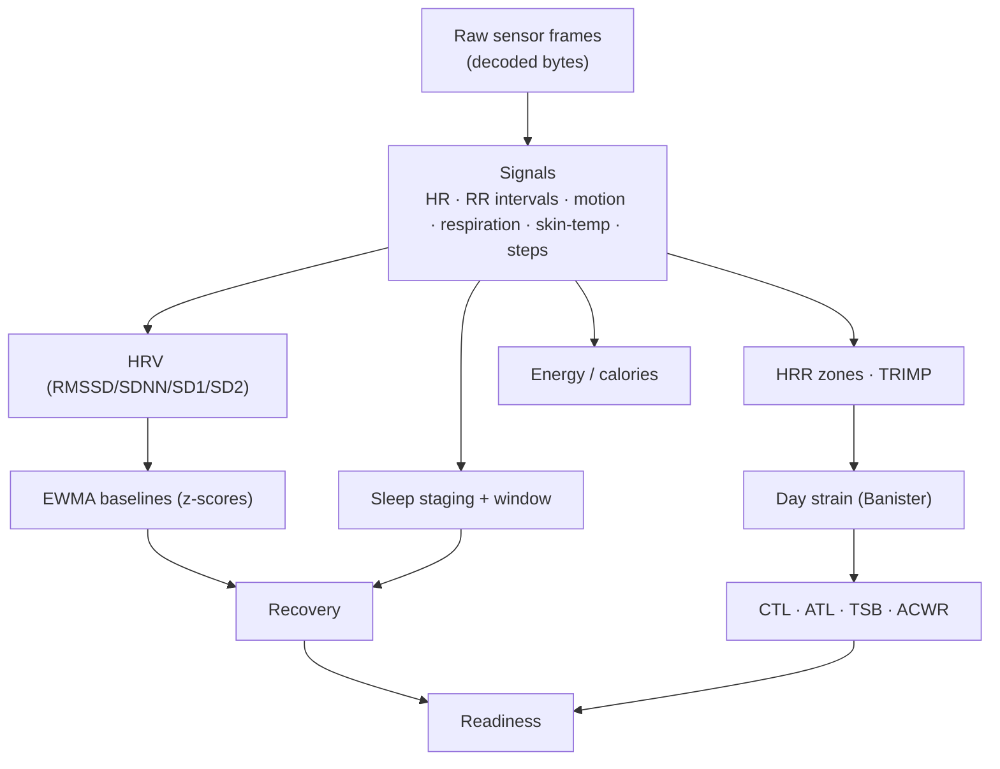

# How it works — the math, in the open

Every number this engine produces comes from a published formula, implemented in `Sources/WhoopCore` and pinned by
golden-vector tests. This page shows the actual math (GitHub renders the equations). Nothing here is a black box.

## 0. Raw values (what's decoded from the device)

| Decoded field | Units | Feeds |
|---|---|---|
| Heart rate (beats-per-minute) | bpm | recovery, strain, zones, calories |
| Beat-to-beat (RR / PPI) intervals | ms | **HRV** (all variants), stress |
| Respiratory rate | breaths/min | respiration trend, recovery |
| Skin temperature | °C | temp trend, illness signal |
| 3-axis accelerometer + gyroscope | g, °/s | motion, steps, sleep actigraphy, calories |
| Optical / PPG | a.u. | SpO₂, perfusion, PPG-derived HRV |

---

## 1. Heart-rate variability (HRV)

For `N` RR intervals $RR_1\dots RR_N$ (milliseconds):

$$\mathrm{RMSSD}=\sqrt{\frac{1}{N-1}\sum_{i=1}^{N-1}\bigl(RR_{i+1}-RR_i\bigr)^2}\qquad \mathrm{SDNN}=\sqrt{\frac{1}{N}\sum_{i=1}^{N}\bigl(RR_i-\overline{RR}\bigr)^2}$$

Poincaré axes (one shared RR set, so the identity is exact):

$$\mathrm{SD1}=\frac{\mathrm{RMSSD}}{\sqrt{2}}\qquad \mathrm{SD2}=\sqrt{\,2\,\mathrm{SDNN}^2-\mathrm{SD1}^2\,}\qquad \text{autonomic balance}=\frac{\mathrm{SD1}}{\mathrm{SD2}}$$

Baevsky Stress Index (50 ms-binned mode $M_o$ in s, amplitude $AM_o=100\cdot\frac{\text{mode count}}{N}$%, range $VR$ in s):

$$\mathrm{SI}=\frac{AM_o}{2\,\cdot VR\cdot M_o}$$

## 2. Heart-rate zones, fitness, VO₂max

$$HR_{max}=208-0.7\cdot\text{age}\ \text{(Tanaka)}\qquad \mathrm{HRR}=\frac{HR-HR_{rest}}{HR_{max}-HR_{rest}}\ \text{(Karvonen)}$$

$$\dot{V}O_2\text{max}\approx 15.3\cdot\frac{HR_{max}}{HR_{rest}}\ \text{(Uth 2004)}$$

5 zones (Z1–Z5) by %HRR bands at 0.5 / 0.6 / 0.7 / 0.8 / 0.9.

## 3. Strain & training load

Banister TRIMP increment per interval ($x=\mathrm{HRR}$, $\Delta t$ minutes):

$$\Delta\mathrm{TRIMP}=\Delta t\cdot x\cdot 0.64\,e^{1.92x}\ \text{(male)}\qquad 0.86\,e^{1.67x}\ \text{(female)}$$

$$\textbf{Day strain}=21\left(1-e^{-\mathrm{TRIMP}/\tau}\right)\in[0,21]$$

Performance-management model over the daily-strain series $L_t$, with $k_c=e^{-1/42}$ (fitness) and $k_a=e^{-1/7}$ (fatigue):

$$\mathrm{CTL}_t=\mathrm{CTL}_{t-1}\,k_c+L_t(1-k_c)\qquad \mathrm{ATL}_t=\mathrm{ATL}_{t-1}\,k_a+L_t(1-k_a)$$

$$\mathrm{TSB}=\mathrm{CTL}-\mathrm{ATL}\qquad \mathrm{ACWR}=\frac{\text{acute (7d)}}{\text{chronic (28d)}}\qquad \mathrm{TSB_{norm}}=\frac{100}{1+e^{-\mathrm{TSB}/10}}$$

## 4. Baselines (what "above/below normal" means)

Each metric keeps an exponentially-weighted rolling baseline (smoothing $\alpha$); a z-score gates "high/low":

$$\mu \leftarrow \mu+\alpha\,(x-\mu)\qquad \sigma^2 \leftarrow (1-\alpha)\bigl(\sigma^2+\alpha\,(x-\mu)^2\bigr)\qquad z=\frac{x-\mu}{\sigma}$$

(Readiness/anomaly flags stay greyed-out until ≥ 7 observations exist.)

## 5. Recovery & readiness

$$\textbf{Recovery}=100\,\Phi\!\left(0.55\,z_{HRV}-0.20\,z_{RHR}-0.10\,z_{RR}+0.15\,z_{Sleep}\right)$$

where $\Phi$ is the standard-normal CDF. Then:

$$\textbf{Readiness}=0.5\,\text{Recovery}+0.3\,\text{SleepScore}+0.2\,\mathrm{TSB_{norm}}-\text{illnessPenalty}$$

## 6. Sleep

The night window is found from **quiet bouts** (low motion + heart rate near the night-time floor), then each epoch is
staged from HR (relative to the night floor), HRV and actigraphy into **deep / REM / light / wake**, with despeckle
smoothing. Outputs: total sleep time, efficiency, the hypnogram, sleep-regularity index (SRI), and:

$$\textbf{Sleep need}= \text{base}+\frac{\text{dayStrain}}{21}\cdot 0.75+\min\!\bigl(0.3\cdot\text{debt},\,1.5\bigr)\ \text{hours}$$

A **daytime nap** is a run of ≥ 20 min where each minute is *quiet* — step-delta $\le 3$ **and** $HR\le HR_{rest}+\text{margin}$ — merging gaps ≤ 3 min.

## 7. Energy / calories

Heart-rate energy expenditure (Keytel 2005, kcal·min⁻¹, male; female coefficients differ):

$$\dot E=\frac{-55.0969+0.6309\,HR+0.1988\,w+0.2017\,a}{4.184}$$

Resting metabolic rate (Mifflin–St Jeor, kcal·day⁻¹; $s=+5$ male, $-161$ female) and lean-mass variant (Katch–McArdle):

$$\mathrm{BMR}=10w+6.25h-5a+s\qquad \mathrm{BMR}=370+21.6\,\mathrm{LBM},\ \ \mathrm{LBM}=w\,(1-\text{bodyfat})$$

All-day burn blends a motion path and the HR path by heart-rate reserve (trust accel when HR is low/noisy, HR when
elevated); step and activity-MET fallbacks fill gaps:

$$\dot E_{\text{day}}=w\,\dot E_{HR}+(1-w)\,\dot E_{accel},\quad w=\mathrm{clamp}\!\left(\tfrac{\mathrm{HRR}-0.30}{0.50-0.30},0,1\right)$$

$$\text{steps}\to\text{km}=\text{steps}\cdot\frac{h\cdot 0.414}{1000},\quad \mathrm{kcal}=\text{km}\cdot w\cdot 0.74\qquad \mathrm{kcal_{MET}}=\mathrm{MET}\cdot 3.5\cdot w/200\cdot\text{min}$$

## 8. Cardio / fitness age

VO₂max drives a baseline age; resting HR, body fat and muscle index nudge it (base 38 M / 33 F, slope 0.325 / 0.30):

$$\text{age}_{VO_2}=20+\frac{\text{base}-\dot{V}O_2\text{max}}{\text{slope}}\qquad \text{FitnessAge}=\text{age}_{VO_2}+\Delta_{RHR}+\Delta_{fat}+\Delta_{muscle}$$

---

*References in the code:* Tanaka 2001, Karvonen, Uth 2004, Banister/TrainingPeaks PMC, Keytel 2005, Mifflin–St Jeor 1990,
Katch–McArdle, Baevsky, ACSM/Compendium of Physical Activities. Every formula above has a matching unit test.
